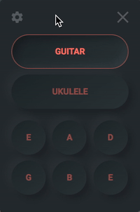

# 📦 Afina
A small and simple to use instrument tuner app.

Afina is a tray app for OSX, that lives on the menu bar and currently supports Guitar and Ukulele.

Feel free to use it and to let me know what you think about it.

## 🎯 Releases:
- [v1.0.0](https://github.com/boguz/afina/releases/tag/v1.0.0)

## 🌈 Download
You can download the OSX App from:
- [Release v1.0.0](https://github.com/boguz/afina/releases/tag/v1.0.0)
- [Download the .dmg file](https://github.com/boguz/afina/releases/download/v1.0.0/Afina-1.0.0.dmg)

## ✨ Features
- Tune Guitar or Ukulele
- Play notes on repeat
- Themes
- Multiple Playback speed
- Real instrument Samples
- Go to next note with Spacebar 

## 🚀 How to use (build OSX App)
1. Clone the project
2. run `npm install`
3. run `npm run make`
4. Copy the App from the 'dist' folder into your 'Applications' folder

## 🐛 Contributing
I started working on this app as a way to improve my JS skills. I had been looking for something like it for a long time, so i thought i would give it a try.

I am sure there are many things we could still improve, so please feel free to report any issues you find, ideas you might have, or just say hello! 👋

## 👷‍ Todos
- [ ] Show different tray icon when app is open
- [ ] Add more instruments
- [ ] Improve themes
- [ ] Add builds for other operating Systems (do they even have tray apps?)
- [ ] Add eslint
- [ ] Add tests
- [ ] add 2 close buttons (one to close app back into tray, another to exit the app)

## 📣 Shoutouts
To create this project i used several different libraries, frameworks,...

[Electron.js](https://www.electronjs.org/), [Electron-builder](https://www.electron.build/)
